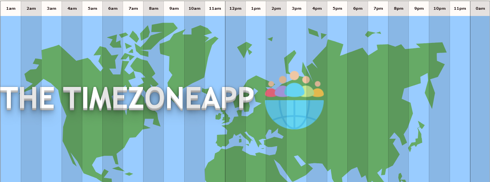

<!-- PROJECT LOGO -->
<div align="center">

</div>
<br />
<p align="center">
  <h2 align="center">Timezone App🌍</h2>

  <p align="center">
    Discover a new level of time zone management with <strong>TimezoneApp</strong>, the must-have app for anyone navigating the global landscape!
    <br />
  </p>
</p>

<!-- TABLE OF CONTENTS -->
<details open="open">
  <summary>Tabela de conteúdos</summary>
  <ol>
    <li>
      <a href="#sobre-o-projeto">About the Project</a>
      <ul>
        <li><a href="#tecnologias-utilizadas">Technologies</a></li>
      </ul>
    </li>
    <ul>
        <li><a href="#regras-de-negócio">Business rules</a></li>
      </ul>
    </li>
    <li>
      <a href="#instruções-gerais">General Instructions</a>
      <ul>
        <li><a href="#instalação">Installation</a></li>
      </ul>
    </li>
    <ul>
        <li><a href="#configurando">Configuration</a></li>
      </ul>
    </li>
    <li><a href="#utilizando-a-api">Usage Examples</a></li>
    </li>
    </li>
    <li><a href="#equipe">Team</a></li>
  </ol>
</details>

<!-- ABOUT THE PROJECT -->

## :notebook_with_decorative_cover: About the project

This project was created to be used by companies with employees in different parts of the world. Its main objective is to foster team collaboration and, consequently, increase productivity by coordinating and comparing team members' availability schedules.

The user will have access to all company employees and will be able to create workgroups where they can communicate through a chat and view a graph displaying their team's availability schedules.

[Check the Timezone App project presentation!](https://www.youtube.com/watch?v=uFSpKCO0Bm8)

All employees of a fictitious company are already registered on the application platform.
To test the application's features, use the access below:

`user: anne@lewagon.com | password: 123456`

To test features like the Groups Chat, you can access the application simultaneously with the user below:

`user: ara@lewagon.com | password: 123456`

[Check or application website!](https://timezone-app-7d2ba652dab0.herokuapp.com/users/sign_in)

### 🛠️ Technologies

<div>
  
  
  
  
  
  
</div>

### 📑Business rules

- All users are pre-registered by the Administrator;
- Users can search for other users and view their information;
- Users can edit their address and working hours;
- Users can create groups with other users;
- Only the user who created the group has the ability to edit or delete it;
- Within a group, it is possible to view a chart displaying the availability of its members' schedules;

<!-- GETTING STARTED -->

## :book: General instructions

Below are the instructions for the installation, configuration, and use of the project's API.

### :electric_plug: Installation

1. Clone the repo

```sh
   git clone https://github.com/ANNEBORTOLI/timezone-app.git
```

2. Configuration
   2.1 Create a file in the root of the project, called [.env].
   2.2 Copy the file contents and enter the new keys [.env.example]
   <br>
3. Installing the packages(gems)

```sh
    bundle install
```

4. Run migrations

```sh
    rails db:migrate
```

5. Run seeders

```sh
    rails db:seeds
```

5. Executar a API localmente

```sh
    rails s
```

<!-- USAGE EXAMPLES -->

## 📸 Usage Examples

All employees of a fictitious company are already registered on the application platform.
To test the application's features, use the access below:

`user: anne@lewagon.com | password: 123456`

To test features like the Groups Chat, you can access the application simultaneously with the user below:

`user: ara@lewagon.com | password: 123456`

![Main Page][main-page]

![Team Chat][team-chat]

![Team Availability][team-availability]

<!-- CONTACT -->

## 👩‍👩‍👦‍👦 Developers

- [Anne Bortoli](https://github.com/ANNEBORTOLI)
- [Araceli Gallardo](https://github.com/atrajkovic)
- [Bruno Fazz](https://github.com/bfazz)
- [Nemanja Trajkovic](https://github.com/Nemonzi/Nemanja-Trajkovic)

<!-- MARKDOWN LINKS & IMAGES -->

[main-page]: public/images/main-page.png
[team-chat]: public/images/team-chat.png
[team-availability]: public/images/team-availability.png
